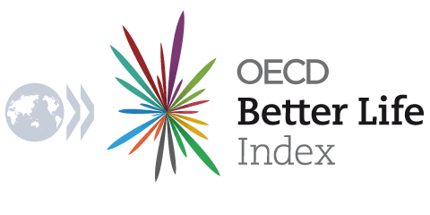
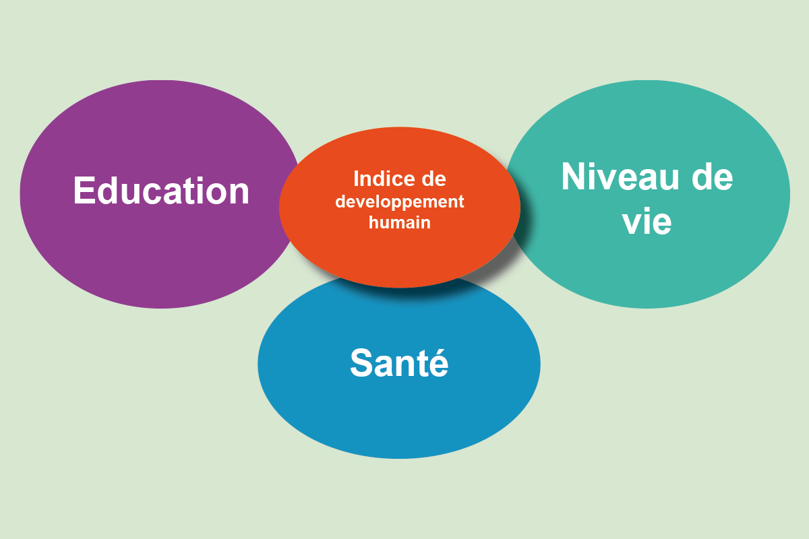
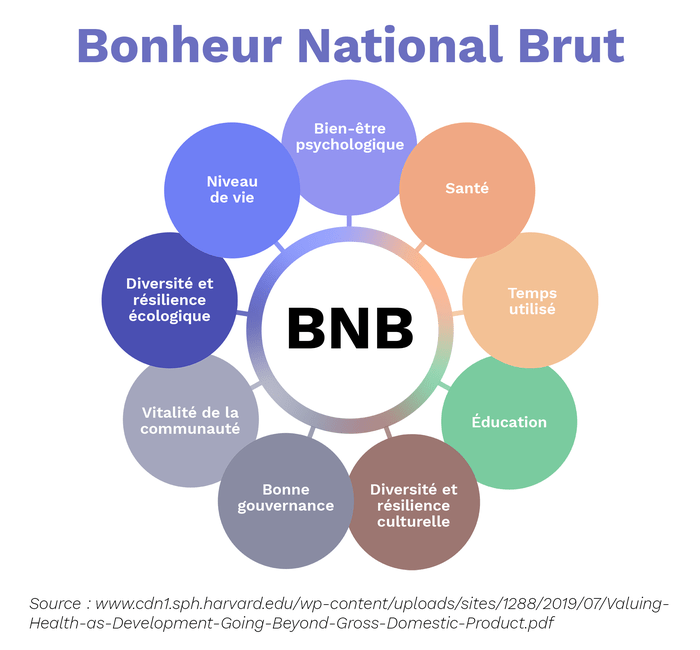

### Better Life Index (OCDE)

Le Better Life Index est un cadre développé en 2011 par l'Organisation de coopération et de développement économiques (OCDE) pour évaluer le bien-être à travers de multiples dimensions de la vie. Il évalue la qualité de vie à l'aide de 11 critères distincts : le logement, le revenu, l'emploi, la communauté, l'éducation, l'environnement, l'engagement civique, la santé, la satisfaction à l'égard de la vie, la sécurité et l'équilibre entre la vie professionnelle et la vie privée. Le BLI est unique en ce qu'il permet aux individus d'attribuer leur propre poids à ces critères, ce qui permet une approche personnalisable pour mesurer ce qui compte le plus pour eux. Dans le cadre de cette étude nous avons eut la chance de faire un entretien avec un statisticien travaillant sur le Better Life Index de l'OCDE. Selon ce dernier de l’OCDE “_la différence majeure réside dans la collecte des données et dans les dimensions mesurées. La mesure du bonheur personnel des citoyens dans le WHR est mesurée à l'aide d'enquêtes subjectives, tandis que le Better Life Index utilise des données objectives. … Les variables ont été sélectionnées afin de refléter les aspects fondamentaux du bien-être. L'objectif était de concevoir un indicateur multidimensionnel, loin de la méthode réductionniste qui ne se focalise que sur le revenu ou le produit intérieur brut._” En offrant un outil interactif, le BLI favorise un plus grand engagement du public et met en évidence la complexité du bien-être.

Le BLI vise à inciter les décideurs politiques, les chercheurs et les gouvernements à se concentrer sur un progrès holistique centré sur l'être humain plutôt que sur les seuls résultats économiques. En mettant l'accent sur des domaines tels que les liens sociaux, la qualité de l'environnement et l'équilibre entre vie professionnelle et vie privée, il met en lumière des aspects du bien-être qui sont souvent négligés dans les mesures traditionnelles. Cependant, il n'est pas sans limites, car il s'appuie sur les données disponibles et des commentaires subjectifs, ce qui peut rendre les comparaisons entre pays moins standardisées. Malgré ces difficultés, le BLI est un cadre puissant qui permet de sensibiliser le public et de mettre en place des politiques qui donnent la priorité à divers aspects de la qualité de vie.

En revanche, l'indice du bonheur mondial, tel qu'il est décrit dans le World Happiness Report, se concentre sur les niveaux de bonheur global dans les pays en utilisant un ensemble plus restreint de facteurs tels que le revenu (PIB par habitant), le soutien social, l'espérance de vie en bonne santé, la liberté de faire des choix, la générosité et les perceptions de la corruption. L'indice de bonheur met l'accent sur la satisfaction subjective de la vie en s'appuyant sur des enquêtes telles que le Gallup World Poll, fournissant un classement mondial du bonheur basé sur la façon dont les individus perçoivent leur vie par rapport à une vie idéale. Sa méthodologie est moins interactive et s'appuie sur des données agrégées pour fournir un score de bonheur unique pour chaque pays.

La principale différence réside dans leur approche et leur objectif. Le Better Life Index donne la priorité à une évaluation multidimensionnelle et orientée vers l'utilisateur de la qualité de vie, permettant aux individus de personnaliser leur compréhension du bien-être. Le Happiness Index, quant à lui, fournit une mesure holistique mais standardisée du bonheur, basée sur des facteurs universels spécifiques. Alors que le BLI encourage la personnalisation, l'indice du bonheur cherche à offrir une référence universelle du bonheur subjectif, ce qui en fait des outils complémentaires plutôt que concurrents.

### Indice de Développement Humain

L’Indice de Développement Humain (IDH) constitue une alternative pertinente à l’indice de bonheur, puisqu’il mesure des dimensions fondamentales du bien-être humain : la santé (via l’espérance de vie), l’éducation (via le niveau moyen et attendu de scolarisation) et le niveau de vie (via le revenu national brut par habitant). Contrairement à l’indice de bonheur, qui repose souvent sur des évaluations subjectives, l’IDH utilise des données objectives, permettant une comparaison standardisée entre les pays.

Bien qu’il ne capture pas directement les aspects émotionnels ou psychologiques du bonheur, l’IDH met en lumière les conditions nécessaires à une vie épanouie, telles que l’accès à l’éducation et à une vie décente, qui sont des bases indispensables pour un bien-être durable.

### Bonheur National Brut

Le Bonheur National Brut (BNB), développé au Bhoutan, propose une vision plus holistique et culturelle du bien-être. Il intègre non seulement des dimensions économiques et sociales, mais aussi des éléments immatériels tels que la préservation de l’environnement, la culture et la santé mentale.

Cette approche multidimensionnelle vise à équilibrer les besoins matériels avec des valeurs spirituelles et collectives, souvent absentes des mesures de bonheur traditionnelles. En adoptant un cadre aussi global, le BNB reconnaît que le bonheur ne peut se réduire à des statistiques économiques ou des évaluations individuelles, mais qu’il dépend d’un équilibre entre aspirations personnelles, relations sociales et ressources naturelles.

