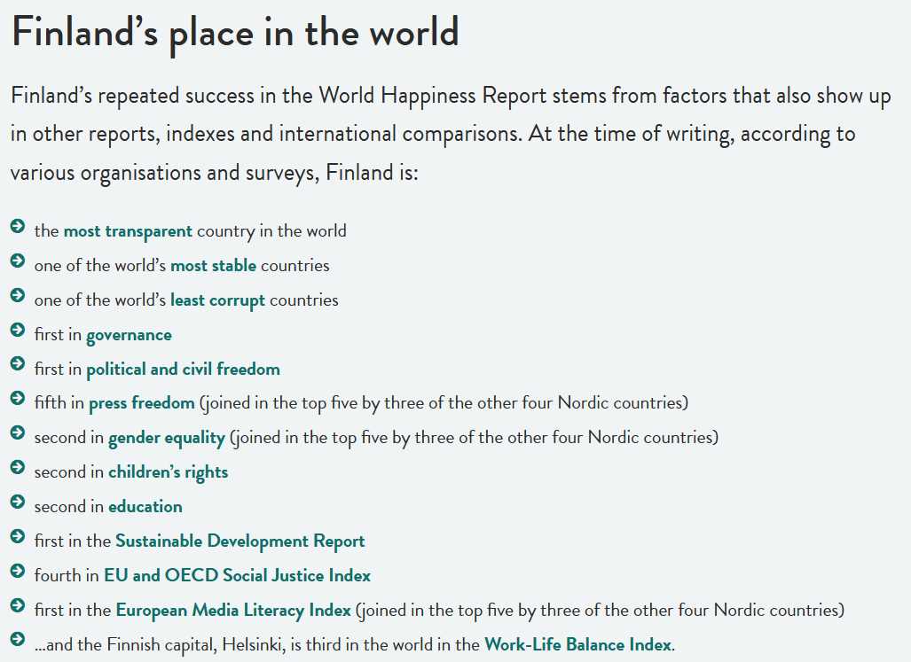

Les classements mondiaux du bonheur, comme ceux du World Happiness Report (WHR), se basent principalement sur des critères universels tels que la satisfaction de vie, le soutien social et le revenu national. Nous avons pu voir dans la partie précédente exactement comment est construit l’index du World Happiness. L'étude s'articule autour de six variables clés, chacune contribuant de manière distincte au score final de bonheur. Cependant, ces classements négligent les différences culturelles qui influencent la perception et l'expression du bonheur. La Finlande et le Japon sont le parfait exemple et nous permettront d’explorer les limites de ces classements. Au sein de ce classement, depuis 2018 la Finlande est régulièrement classée et considérée comme le pays le plus heureux du monde. C’est pourquoi elle est considérée par de nombreuses personnes comme un modèle de bonheur. Une combinaison d’éléments tels qu'un PIB par habitant élevé, une stabilité politique, une égalité sociale ainsi que l'accès à des services publics (éducation, soins de santé, logement) expliquent ce score élevé. Une liste exhaustive des raisons pour lesquelles la Finlande se trouve en première place de ce classement est présentée ci-dessous: 

Cependant, le Japon est souvent classé autour de la 50e place malgré une prospérité. Cela peut paraître surprenant lorsque le pays a des infrastructures développées, un PIB assez élevé et un niveau d’espérance de vie exceptionnel. Malgré tout, il se classe bien loin de la Finlande (50e place en 2023). Il semblerait que cette différence mette en évidence les différences dans le rapport au bien-être de chaque culture. Cela remet donc en question la validité des mesures universelles pour saisir ces nuances. 

### Le concept de satisfaction de vie : un biais individualiste

Le WHR utilise principalement la question suivante : "_En pensant à votre vie comme un tout, où vous situez-vous sur une échelle de 0 à 10, 10 étant la meilleure vie possible ?_". En Finlande, les personnes accordent une grande importance à leur bien-être personnel et sont donc à l'aise d’exprimer des niveaux élevés de satisfaction. Les valeurs telles que la liberté personnelle et le bien-être matériel entrent parfaitement dans les critères du WHR. En revanche, la culture japonaise accorde une plus grande importance à l'équilibre social et aux relations interpersonnelles que la Finlande. De plus, les japonais ont généralement tendance à sous-estimer et amoindrir leur niveau de satisfaction personnelle. En effet, pour les Japonais exprimer ses satisfactions personnelles peut être vu comme un manque d'humilité. Enfin, il semblerait que pour évaluer de manière équilibrée et juste le bien être de chaque pays il faudrait prendre en compte ces différences idéologiques et culturelles. Prendre en compte ces dimensions et imaginer de nouvelles questions seraient souhaitables pour mieux évaluer le bien-être. 

### Les normes culturelles et la définition du bonheur

Le concept du bonheur est influencé par des contextes culturels, sociaux et historiques propres à chaque pays. La Finlande et le Japon illustrent ces divergences et offrent deux perspectives contrastées.

En Finlande, le bonheur est défini comme un sentiment plus subjectif lié aux émotions positives et au bien-être. Cette conception représente les valeurs de l'Occident où l'indépendance et l'épanouissement personnel sont très importants. Selon l’Observatoire des inégalités, "_le WHR, tout comme de nombreux autres indicateurs globaux, s'appuie sur des critères qui sont fortement guidés par des valeurs occidentales. À titre d'exemple, on valorise la liberté individuelle ou l'autodétermination, ce qui est une vision caractéristique des sociétés libérales._"

La conception la plus générale du bonheur est perçue comme un état d'équilibre et de paix. La satisfaction au niveau personnel a relativement peu d'importance par rapport à l'harmonie sociale ou au bien-être collectif ou même familial. Les valeurs de la culture japonaise reposent sur l'inclusion et la conformité aux normes sociales, ainsi que sur les devoirs envers la famille et la communauté. Une telle définition du bonheur du point de vue japonais a été expliquée comme émanant des traditions et de la culture bouddhistes du pays. Ici, l'interdépendance, la sobriété et les responsabilités sociales sont quelques-unes des valeurs chéries au-dessus de celles typiques des religions occidentales traditionnelles.

Le rapport sur le bonheur mondial se sert de la vision occidentale du bonheur pour en faire une vérité globale. Ce biais méthodologique peut nuire aux pays qui ne se conforment pas à cette perception. C'est le cas au Japon où la joie est moins liée à des facteurs purement personnels et davantage à des concepts immatériels. Par conséquent, le WHR pourrait mal interpréter des cultures dans lesquelles le bonheur est vécu et interprété de manière différente en adoptant une démarche universelle fondée sur les valeurs occidentales. Pour une évaluation plus juste, il serait nécessaire d'utiliser des indicateurs qui correspondent aux spécificités culturelles de chaque zone du monde et plus précisément de chaque nation. Cette éventuelle aptitude à considérer des concepts tels que la cohésion sociale, le devoir collectif ou la signification d'une appartenance communale rendrait ce classement plus approprié. 

### L'importance du bien-être émotionnel

Un problème fondamental dans la mesure du World Happiness Report (WHR) est la mesure du bien-être émotionnel. Il se concentre seulement sur la satisfaction cognitive de la vie, c'est-à-dire une évaluation rationnelle et générale de sa situation personnelle, tout en ignorant les émotions rencontrées au quotidien. Le biais de cette décision méthodologique réside dans le fait qu'elle ne parvient pas à prendre en compte les différences culturelles dans l'importance et l'expression des sentiments.

En Finlande, on accorde une grande importance aux émotions positives et calmes, telles que la sérénité et le contentement. La culture finlandaise répond parfaitement aux critères du WHR. A contrario, le Japon est influencé par des traditions telles que le bouddhisme zen et  accorde une grande importance à la maîtrise des émotions et à l'équilibre social. Cette différence de perception classe une fois de plus le Japon plus bas que la Finlande non pas parce que ses habitants sont moins heureux, mais parce que leurs idées concernant le bonheur échappent à la méthodologie du rapport.

### Le soutien social : des conceptions différentes

La mesure dans le WHR du soutien social témoigne de différentes conceptions culturelles. Un série de questions standardisées (par exemple la présence d'un proche en cas de nécessité) est utilisée pour la perception de soutien social au sein d’une population. Cependant, cette méthode favorise les formes explicites de soutien, caractéristiques des sociétés occidentales, et néglige les dynamiques culturelles plus implicites qui existent ailleurs.

Le soutien social est très institutionnalisé en Finlande. Le rôle essentiel des systèmes publics performants, comme les soins de santé gratuits et les filets de sécurité sociale, est de diminuer la dépendance directe envers les proches. Demander  de l'aide d'un proche est considéré comme une interaction normale et n’est pas stigmatisé en Finlande. Au Japon, en revanche, le soutien social repose davantage sur le cercle familial. La conception de famille au Japon vient avec des obligations implicites fondées sur des traditions culturelles. La vieillesse et la sagesse n’ont pas le même statut dans ces pays. Au Japon, prendre soin de ses grands-parents de manière quotidienne est une obligation. Il est fréquent que les grands-parents vivent sous le même toit que le reste de la famille. Ce n’est plus le cas pour un grand nombre de pays européens, dont la Finlande. Par conséquent, le WHR ne reflète pas les différentes formes de soutien social qui existent dans des cultures collectivistes telles que le Japon.

### L’impact du stress et des attentes sociales

Le stress et les attentes sociales ont un impact sur la perception du bonheur, une influence qui varie en fonction des cultures, influençant ainsi les résultats d'études comme le rapport mondial de la joie (WHR).

Au Japon, la pression pour réussir est omniprésente, que ce soit au travail, à l’école ou à l’université. Ces exigences et cette pression se fondent sur des principes traditionnels et culturels. Cependant, ce modèle engendre un stress constant susceptible de masquer le bonheur général des individus. Ce paradoxe illustre un écart entre la façon de vivre le bonheur dans la vie quotidienne et sa mesure. En revanche, en Finlande, les exigences sociales diminuent et le mode de vie privilégie la simplicité et l'équilibre personnel. Cette culture réduit le stress en privilégiant des valeurs essentielles comme le bien-être personnel et la liberté de choix. L'établissement de ces conditions encourage une perception plus positive du monde, ce qui se reflète dans les recherches sur le WHR, généralement plus en adéquation avec les principes occidentaux d'épanouissement personnel et de contentement psychologique. 

