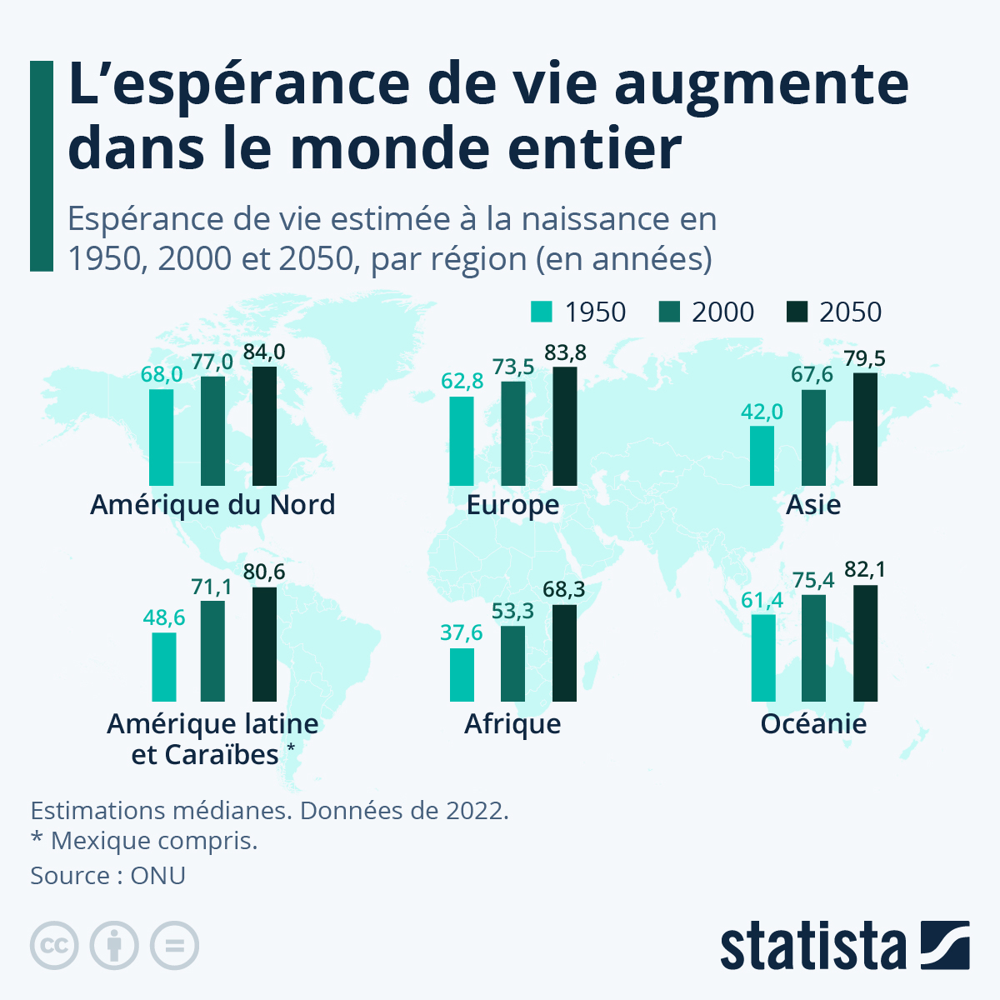

### Le PIB par tête réel et l’indice de Gini

L’indicateur de PIB par tête (ou PIB par habitant) est souvent utilisé pour mesurer la richesse économique moyenne d’un pays. Cependant, il présente des limites importantes, notamment lorsqu’il s’agit d’estimer le bien-être ou la richesse réelle d’un habitant moyen. Le PIB par tête, étant une simple moyenne, ne tient pas compte de la répartition des richesses dans la population. Par exemple, si une petite élite accapare une grande partie du revenu national, le PIB par tête peut sembler élevé, même si la majorité de la population vit dans la pauvreté. Cela se vérifie particulièrement dans certains pays riches en ressources naturelles (pétrole, gaz), où une grande partie des revenus est concentrée dans les mains de quelques individus ou entreprises.

De plus, cet indicateur ne prend pas en compte les variations du coût de la vie entre les pays, ou même entre les régions d’un même pays. Ainsi, un PIB par tête élevé dans un pays où le coût de la vie est très élevé peut ne pas suffire à offrir un niveau de vie confortable à ses habitants. Pour mieux estimer la richesse d’un habitant moyen, on peut combiner le PIB par tête réel (ajusté à l’inflation) avec l’indice de Gini, qui mesure les inégalités de revenus. Le PIB par tête réel fournit une idée générale de la richesse moyenne en termes de pouvoir d’achat, tandis que l’indice de Gini reflète comment cette richesse est distribuée. Si le PIB par tête est élevé, mais que l’indice de Gini indique une forte inégalité, cela signifie que la richesse est concentrée dans une minorité, et que la majorité peut être bien moins aisée que la moyenne ne le suggère. L’Observatoire des inégalités suggère "_qu’une dimension d'inégalités pourrait être ajoutée au WHR, mais cela demanderait une révision profonde de ses méthodologies._"

Enfin, cette approche prend aussi en compte, indirectement, les différences de coût de la vie. Par exemple, le PIB réel ajusté à la parité de pouvoir d’achat (PPA) peut refléter plus fidèlement le pouvoir d’achat des habitants. Ensemble, ces outils offrent une évaluation plus équilibrée et réaliste du bien-être économique moyen.

### L’espérance de vie

L’espérance de vie, bien qu’indicative du niveau de santé et de développement d’une société, n’est pas un bon estimateur du bonheur. Elle mesure uniquement la durée moyenne de vie, et non sa qualité. De plus, l’espérance de vie est fortement influencée par des facteurs externes tels que le régime alimentaire, l’environnement naturel et les gènes, qui ne sont pas directement liés au bonheur. Un environnement sain ou une bonne génétique peuvent prolonger la vie sans nécessairement augmenter la joie ou l’épanouissement personnel.

À l’inverse, des individus vivant dans des conditions plus difficiles, avec une espérance de vie plus courte, peuvent être heureux grâce à des réseaux sociaux solides, des traditions enrichissantes ou une philosophie de vie optimiste. Ainsi, l’espérance de vie ne prend pas en compte la diversité des chemins vers le bonheur et ne reflète qu’un aspect limité du bien-être humain.

Pour conclure, l’espérance de vie ne devrait pas se limiter à indiquer un âge moyen, comme le montre le document ci-dessous, mais intégrer des dimensions plus complexes comme la qualité de vie, la santé physique et mentale, ou l’accès aux soins. Dans le cadre du Happiness Index, elle devrait refléter non seulement la durée de vie, mais aussi les conditions qui rendent ces années véritablement épanouissantes.

### Le taux de suicide

Intégrer le taux de suicide dans la mesure de l’indice de bonheur permettrait de mieux refléter les réalités du bien-être au sein d’une population. Cet indicateur est souvent révélateur des souffrances psychologiques, sociales ou économiques que d’autres métriques traditionnelles, comme le revenu ou l’espérance de vie, pourraient masquer. Par exemple, dans des pays où les conditions matérielles semblent idéales, un taux de suicide élevé pourrait révéler des problèmes sous-jacents tels que l’isolement social, la pression sociétale ou un manque de soutien psychologique.

En incluant ce facteur, l’indice de bonheur pourrait mieux détecter les déséquilibres émotionnels et sociaux, offrant ainsi une représentation plus nuancée de la qualité de vie. De plus, le taux de suicide met en lumière les limites des facteurs souvent corrélés au bonheur, comme la richesse, la santé ou l’éducation, qui ne suffisent pas toujours à garantir une vie épanouie.

Inclure cet indicateur inciterait également les décideurs à développer des politiques axées sur le soutien psychologique et la santé mentale, complétant ainsi les efforts visant à améliorer les conditions matérielles. Cela rendrait les initiatives de mesure du bonheur national plus complètes et mieux adaptées aux réalités humaines.

### La satisfaction au travail

Ajouter la satisfaction au travail à l’indice de bonheur permettrait de mieux capturer une dimension essentielle de la vie quotidienne. Le travail occupe une part importante du temps des individus, et leur satisfaction dans ce domaine reflète non seulement des aspects matériels, comme la rémunération, mais aussi des dimensions immatérielles, comme le sentiment d’accomplissement, la reconnaissance, les relations interpersonnelles et l’équilibre entre vie professionnelle et personnelle.

Un travail épanouissant contribue à la santé mentale, à la motivation et à une perception positive de soi. À l’inverse, un environnement de travail toxique ou frustrant peut engendrer stress, anxiété et insatisfaction globale. En intégrant la satisfaction au travail dans l’indice de bonheur, on obtiendrait une vision plus représentative de la diversité des expériences humaines et on identifierait des leviers pour améliorer la qualité de vie dans un aspect central de l’existence.
