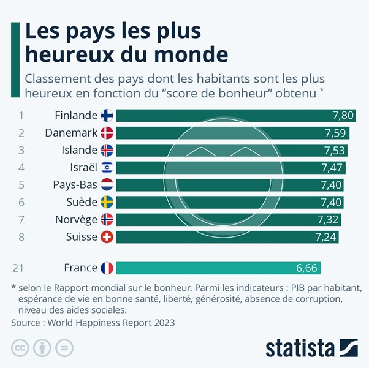

### L’omission des inégalités et des contextes spécifiques  
Le WHR tend à privilégier des moyennes nationales, ignorant ainsi les inégalités internes qui modifient fondamentalement le vécu du bonheur. Comme l’indique le membre de l’Observatoire des Inégalités durant notre entretien, "_la principale limitation du WHR réside dans sa base sur une moyenne nationale qui comble les inégalités internes._" Par exemple, les États-Unis, bien classés sur des dimensions comme la richesse, sont également marqués par des taux élevés d’inégalités économiques et raciales. De telles disparités internes ne sont pas reflétées dans les classements globaux, ce qui soulève des questions quant à la pertinence de l’analyse.  

De plus, le membre de l’Observatoire des inégalités durant notre entretien déclarait "_Une des principales faiblesses de cet indice réside dans sa capacité à dissimuler les réalités sociales internes, ce qui peut être trompeur pour les décideurs qui pourraient se focaliser sur des aspects généraux plutôt que sur les inégalités._" les classements des pays nordiques, souvent perçus comme des "_havres de bonheur_", ignorent des problèmes sociaux majeurs tels que les taux élevés de suicide en Finlande et d’endettement personnel au Danemark. Michael Booth, dans son livre _The Almost Nearly Perfect People_ (2014), souligne ces paradoxes, critiquant la vision romantique souvent associée à ces pays.  

### Le cas de la France dans le World Happiness Report 

La France est souvent considérée comme l'un des pays les plus heureux du monde, se classant dans les 25 premiers du World Happiness Report. Cette position cache cependant d'importantes disparités internes. Malgré un niveau de bonheur relativement élevé (6,66 en 2023), les inégalités géographiques et sociales persistent et tendent même à s'accroître. L'écart se creuse entre les grandes villes comme Paris, où les services publics sont bien fournis, et les zones rurales et les quartiers défavorisés. Les habitants de ces zones rencontrent davantage de problèmes sociaux et économiques, ce qui a un impact important sur leur bien-être.

De plus, les disparités économiques en France, bien que moins marquées qu'aux États-Unis, restent préoccupantes. Les jeunes générations sont les plus touchées, confrontées à des défis majeurs tels que le chômage élevé et les incertitudes climatiques. Ces disparités géographiques et sociales sont souvent ignorées dans les calculs de WHR. Cela représente une limite importante dans la construction de cet indice.

### Des comparaisons générationnelles préoccupantes  
En 2024, le WHR inclut pour la première fois des classements par groupe d’âge. Les résultats montrent des disparités générationnelles frappantes : les jeunes adultes (15-24 ans) en Amérique du Nord et en Europe occidentale rapportent un bien-être décroissant depuis 2019. Cette tendance, associée à des pressions économiques et sociales accrues, contraste avec l’augmentation du bien-être des générations plus âgées dans ces mêmes régions. Ce phénomène illustre une fracture générationnelle que le WHR ne contextualise pas suffisamment, renforçant l’impression que ses classements globaux masquent des réalités complexes.

Cette fracture générationnelle est aussi perceptible en France. Malgré une stabilité du bien-être global des adultes, les jeunes générations manifestent un pessimisme grandissant face aux incertitudes économiques, à la précarité du marché du travail et aux préoccupations environnementales. Le sentiment d'injustice sociale et une perception croissante des inégalités accentuent ces défis, notamment parmi les jeunes diplômés qui ont du mal à trouver des emplois stables. Ce contraste entre le bien-être des générations plus âgées et celui des jeunes adultes, dissimulé par les moyennes globales, met en lumière une dimension souvent sous-estimée du bonheur national.
